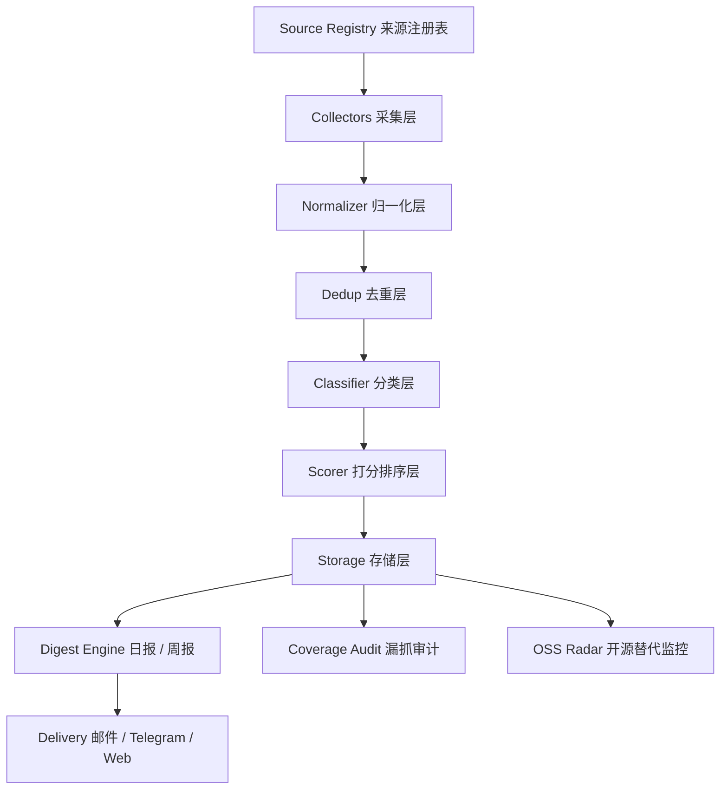

# 香港部署版 AI / 政策情报系统完整方案

## 1. 项目定位

这个项目不是一个普通的新闻聚合器，也不是一个为了“尽量抓全所有信息”的爬虫系统，而是一个部署在香港 VPS 上、面向个人长期使用的情报系统。它的目标是每天自动收集与你相关的 `AI 大模型 / 新技术突破 / 开源项目动态 / 中国政策 / 地方扶持 / 补贴 / 产业方向`，再经过去重、过滤、排序、汇总，最终形成你每天能快速浏览、每周能拿去给 `GPT Plus` 深度分析的高质量 digest。

这个系统成立的关键，不是“抓得最多”，而是“高价值信息尽量别漏、噪音尽量少、外部出现更好的开源项目时你可以快速吸收进来”。所以它的价值应该建立在：

- 多源冗余
- 自定义筛选
- 周报沉淀
- 可替换架构
- 漏抓审计
- 开源替代雷达

## 2. 为什么选择香港部署

部署在香港的好处非常直接：

- 访问 GitHub、arXiv、Hugging Face、国外 AI 博客更稳定
- 相比部分内地机房，对国际源抓取更友好
- 同时访问中国政府公开站点通常也可接受
- 适合作为“跨中英文信息源”的中间节点

香港部署的现实建议：

- 操作系统：`Ubuntu 22.04 LTS` 或 `Ubuntu 24.04 LTS`
- 规格建议：最低 `2C2G`，推荐 `2C4G`
- 部署方式：`Docker Compose`
- 反向代理：`Caddy` 或 `Nginx`
- 数据库：`SQLite` 起步，后续可切 `PostgreSQL`
- 定时任务：容器内 cron 或宿主机 systemd timer

## 3. 目标范围

系统分两条主线：

### 3.1 AI 主线

重点关注：

- 大模型发布
- 新技术突破
- 新论文
- 开源模型
- GitHub 热门项目
- Agent、RAG、多模态、推理优化、部署工具链

### 3.2 政策主线

重点关注：

- 中国中央政策
- 地方政策
- 产业扶持
- 补贴
- 试点
- 申报通知
- 监管变化
- 对农业、新能源、AI、数据、制造业等方向有实际影响的政策

## 4. 成功标准

这个系统不是追求“全网全覆盖”，而是追求以下结果：

1. 每周你主观认为最重要的 10 条信息，系统至少覆盖 7 到 9 条。
2. 每日日报控制在 10 到 25 条以内。
3. 每周周报控制在 1 份结构化 Markdown，可直接贴给 GPT Plus。
4. 单个来源失效不会导致系统整体失效。
5. 新出现的开源项目可以被纳入系统，而不是推翻系统。

## 5. 总体架构



## 6. 关键设计原则

### 6.1 不依赖单一源

任何一个主题都不应该只依赖一个来源。比如“AI 新模型发布”至少同时来自：

- GitHub / Hugging Face
- 技术媒体
- 官方博客
- 社区讨论

“政策补贴”至少来自：

- 政府官网
- 部委站点
- 地方站点
- 权威解读源

### 6.2 不依赖单一工具

不能把系统价值绑死在某个项目上，比如只依赖 RSSHub、只依赖微信公众号、只依赖某个 AI 摘要产品。因为任何一个组件都可能失效、归档、被限流或不再维护。

### 6.3 排序比抓取更重要

抓 500 条信息不代表有价值。真正有价值的是：把最值得你看的 10 到 20 条排在前面。

### 6.4 系统必须可审计

系统必须回答两个问题：

- 我这周漏了什么
- 有没有更好的开源项目值得直接接入

## 7. 数据源策略

## 7.1 AI 数据源

优先级最高：

- arXiv：`cs.AI`、`cs.CL`、`cs.LG`、`cs.CV`
- GitHub：trending、release、指定组织、指定 topic
- Hugging Face：blog、模型动态、热门模型
- OpenAI、Anthropic、Google DeepMind、Meta AI 官方博客
- Papers with Code

第二优先级：

- Hacker News
- Reddit AI 相关版块
- 机器之心
- 量子位
- 36氪 AI
- InfoQ AI

第三优先级：

- YouTube 技术频道
- X / Twitter
- B站技术频道

## 7.2 政策数据源

优先级最高：

- 中国政府网政策频道
- 国务院政策文件库
- 国家发展改革委
- 工信部
- 农业农村部
- 财政部
- 商务部
- 科技部
- 国家能源局
- 国家数据局
- 网信办

第二优先级：

- 重点省市政府官网
- 地方发改委、工信局、农业农村局
- 地方产业扶持和招商平台

第三优先级：

- 新华社政策解读
- 中国政府网解读栏目
- 权威媒体政策解读
- 微信公众号补盲

## 7.3 关于微信和难源

微信公众号可以作为补盲源，但不能当底层主骨架。原因很现实：

- 不稳定
- 可维护性弱
- 兼容性不稳定
- 很容易拖累系统整体可用性

如果接入微信，建议只把它作为补充层，并且允许它随时失败而不影响主流程。

## 8. 推荐技术栈

- 后端语言：`Python 3.11+`
- 框架：`FastAPI`
- 采集：`httpx` + `feedparser` + `beautifulsoup4` + 少量自定义 adapter
- 定时：`APScheduler` 或 cron
- 数据库：`SQLite` 起步
- ORM：`SQLAlchemy`
- 模板：`Jinja2`
- 日志：`structlog` 或标准 logging
- 配置：`.env` + `YAML`
- 部署：`Docker Compose`

## 9. 模块设计

## 9.1 Source Registry

`sources.yaml` 是整个系统最重要的资产之一。每个来源应包含：

- id
- name
- category
- region
- type：rss / api / html / custom
- url
- enabled
- priority
- update_frequency
- reliability_score
- authority_score
- tags
- backup_sources

## 9.2 Collectors

每类来源对应一个 adapter：

- `RSSCollector`
- `GitHubCollector`
- `ArxivCollector`
- `HTMLPolicyCollector`
- `CustomFeedCollector`

所有采集器都输出统一结构：

- title
- url
- published_at
- source_id
- raw_summary
- raw_content
- region
- tags

## 9.3 Normalizer

统一处理：

- 标题清洗
- 时间标准化
- URL 归一化
- HTML 转纯文本
- 重复空白清理

## 9.4 Dedup

至少做三层去重：

- 同 URL 去重
- 同标题去重
- 标题近似去重

## 9.5 Classifier

分类至少包括：

- AI-Research
- AI-OpenSource
- AI-Industry
- Policy-Central
- Policy-Local
- Policy-Subsidy
- Policy-Regulation
- Agriculture
- Energy
- Manufacturing
- Data / Compliance

## 9.6 Scorer

评分维度建议：

1. 来源权威度
2. 关键词命中度
3. 主题匹配度
4. 发布时间新鲜度
5. 多源交叉出现次数
6. 你的地区 / 关注方向权重
7. 历史点击反馈

## 9.7 Digest Engine

输出两种主要结果：

- `daily_digest.md`
- `weekly_digest.md`

每条内容包含：

- 标题
- 来源
- 时间
- 链接
- 分类
- 分数
- 一句话摘要
- 为什么值得看

## 9.8 Delivery

优先建议：

- 邮件
- Telegram

后续可选：

- Web dashboard
- 飞书 / 企业微信

## 9.9 Coverage Audit

这是系统长期价值的关键模块。

每周做三种检查：

1. 与外部参考列表对比
2. 人工补录 missed items
3. 统计某类高频主题是否未进周报

## 9.10 OSS Radar

每周自动搜索和归档这些方向的开源项目：

- RSS / Feed aggregation
- AI summarization
- GitHub / arXiv discovery
- Policy scraping
- WeChat / X 补盲
- Digest generation

输出一份 `oss_radar.md`：

- 新出现的项目
- 值得试用的项目
- 应接入而不是自研的模块
- 应替换的旧模块

## 10. 数据库设计

核心表建议：

- `sources`
- `items`
- `item_tags`
- `runs`
- `missed_items`
- `feedback`
- `oss_projects`

`items` 关键字段：

- id
- source_id
- title
- url
- normalized_url
- published_at
- fetched_at
- category
- subcategory
- region
- summary
- reason
- score
- hash

## 11. 目录结构建议

```text
project/
  app/
    api/
    collectors/
    classifiers/
    scoring/
    digest/
    delivery/
    audit/
    db/
    templates/
    utils/
    main.py
  configs/
    sources.yaml
    keywords.yaml
    scoring.yaml
  data/
    app.db
    digests/
    cache/
  scripts/
    run_daily.py
    run_weekly.py
    seed_sources.py
  deploy/
    docker-compose.yml
    Dockerfile
    Caddyfile
  tests/
  .env.example
  README.md
```

## 12. 香港部署建议

### 12.1 反向代理

推荐 `Caddy`，因为自动 HTTPS 更省心。

### 12.2 调度时间

推荐香港时间：

- 每天 `07:00` 跑日抓取
- 每天 `07:20` 生成日报
- 每周六 `08:00` 生成周报
- 每周六 `08:10` 生成 OSS Radar

### 12.3 部署方式

推荐容器：

- `app`
- `caddy`
- 可选 `rsshub`

### 12.4 资源建议

- MVP：`2C2G`
- 推荐：`2C4G`
- 如果未来要本地跑模型：`4G+`

## 13. 为什么这个项目不会轻易失去价值

只要你把它做成下面这种形态，它就不会因为漏掉部分信息或外部出现更好的开源项目而失去意义：

- 它不是单一工具，而是一个编排层
- 它的价值不在“抓源”，而在“选源、排序、周报和审计”
- 它内建 OSS Radar，可以持续吸收外部项目
- 它内建 Coverage Audit，可以持续减少漏抓

真正会让它失去价值的，不是外面有更好的开源工具，而是你把它做成：

- 单源依赖
- 单体结构
- 不可替换
- 不可审计
- 没有反馈闭环

## 14. 一期 MVP 边界

一期只做：

- 20 到 30 个高价值来源
- 基础采集器
- SQLite
- 每日日报
- 每周周报
- 邮件推送
- 漏抓审计表
- OSS Radar 表

一期不做：

- 复杂前端
- 登录系统
- 本地大模型摘要
- 全量全国地市政策
- 微信强依赖
- X 强依赖

## 15. 二期升级方向

- 接入 `RSSHub`
- 接入 AI 一句话摘要
- 用户反馈学习
- 更复杂的政策标签体系
- Web dashboard
- Telegram bot 交互
- 地区热度图

## 16. 交付物建议

你让开发代理一次性生成时，至少要产出：

- 可运行后端
- 数据库初始化
- 采集器骨架
- 默认配置
- Dockerfile
- docker-compose.yml
- README
- 示例 digest
- 基础测试

## 17. 最终判断

这个项目值得做，但前提是你要接受一件事：它永远不可能全量无遗漏，它真正的目标是“尽量高召回地抓住真正重要的信息，并越来越贴近你的判断习惯”。

如果这样定义，它不但不会因为不完整而失去价值，反而会随着你不断调整来源、关键词、评分和审计机制而越来越有价值。
